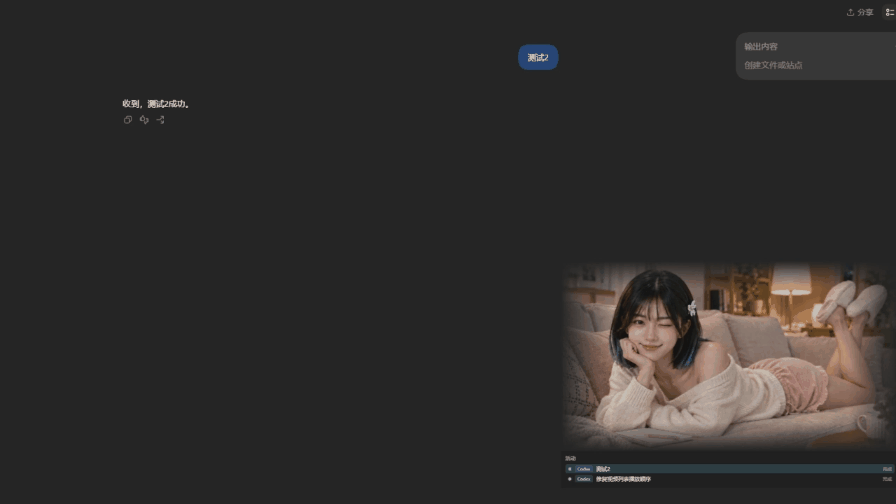
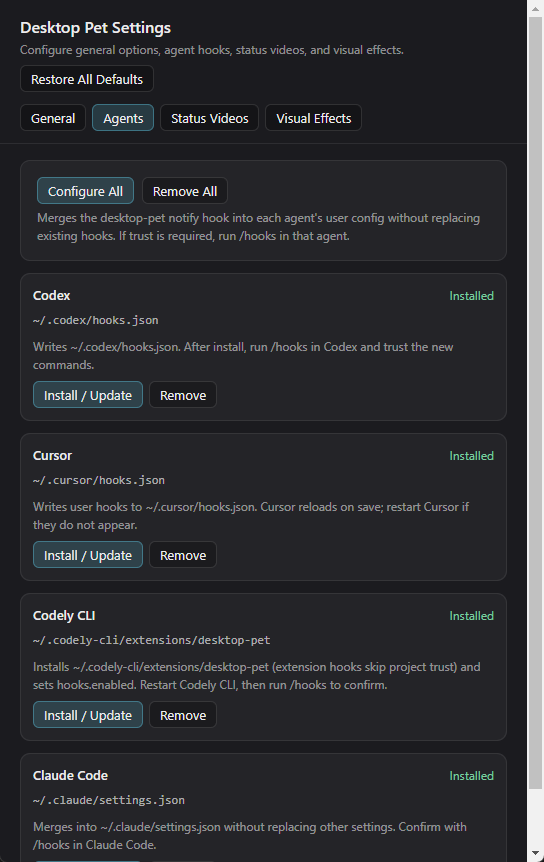
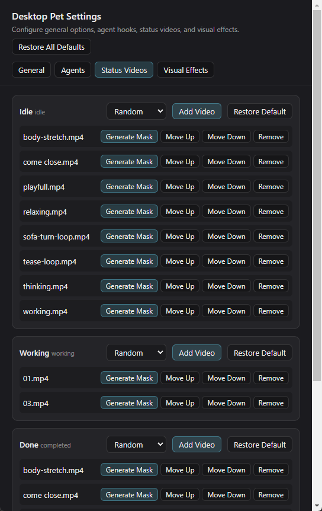

# Hana — AI Agent Desktop Pet

<p align="center">
  
</p>



---

## What Hana does

| Your agent | Hana |
| --- | --- |
| Is idle | Plays a calm idle animation |
| Thinks, receives a prompt, or calls a tool | Switches to a working animation |
| Completes or fails a task | Shows a completion animation until you acknowledge it |

Hana is more than a status indicator. Her panel lists up to eight recent agent sessions, including their title and status. Pin a session to keep it in focus, or let Hana automatically follow the most recently active session.

## Quick start

**Requirements:** Windows, Node.js, and an AI coding agent with hooks or command callbacks.

```powershell
cd D:\Project\My\DestokPet
npm install
npm run make-placeholders
npm start
```

The pet appears as a transparent window near the bottom-right of your desktop. It is useful immediately for Codex local-session monitoring; install hooks to receive real-time updates from supported agents.

## User guide

### Daily controls

- **Move Hana:** hold the left mouse button on the character and drag.
- **Resize Hana:** point at the character, hold `Ctrl`, and scroll the mouse wheel.
- **Focus a session:** click a session below the video to pin it; click again to unpin and resume automatic following.
- **Open the source task:** click a Codex session to open it in Codex, or a Cursor session to return to its workspace.
- **Use the tray menu:** right-click the Hana tray icon to view sessions, change settings, reload videos, hide/show the pet, or quit.

### Understanding states

Hana uses three presentation states: `idle`, `working`, and `completed`.

- `working` has priority whenever any observed task is active.
- `completed` remains visible while a task is still unread, so a finished task does not disappear before you notice it.
- `idle` is used when no active or unread-completed task remains.

The local companion service listens only on `127.0.0.1:17331`. Open `http://127.0.0.1:17331/sessions` to inspect its current session snapshot.

## Connect an agent

Hana is designed for **any agent that can invoke a local command or send an HTTP request from a hook**. Built-in installers currently support the following agents:

| Agent | Install command | What is changed |
| --- | --- | --- |
| Codex | `npm run install-hooks:codex` | Merges Hana handlers into `~/.codex/hooks.json` |
| Cursor | `npm run install-hooks:cursor` | Merges handlers into `~/.cursor/hooks.json` |
| Codely CLI | `npm run install-hooks:codely` | Installs a `desktop-pet` extension and enables hooks |
| Claude Code | `npm run install-hooks:claude` | Merges handlers into `~/.claude/settings.json` |
| All supported agents | `npm run install-hooks` | Installs every integration above |

The installer backs up an existing configuration before writing and preserves unrelated hooks. Restart the target agent afterwards. Codex and Claude Code may ask you to run `/hooks` and trust the new command; Cursor normally reloads its user hooks automatically.

### Connect another hook-capable agent

For an agent without a built-in installer, configure its hook to send a JSON `POST` to Hana's local endpoint. Use `/ensure` for a session start so the pet is launched when needed; use `/state` for all other events.

```powershell
$body = @{
  source = "hook"
  agent = "codex"
  event = "UserPromptSubmit"
  session_id = "my-agent-session-42"
  title = "Implement the settings screen"
  payload = @{ cwd = "D:\\Projects\\my-app" }
} | ConvertTo-Json -Depth 3

Invoke-RestMethod -Method Post `
  -Uri "http://127.0.0.1:17331/state" `
  -ContentType "application/json" `
  -Body $body
```

Supported state-driving events are `SessionStart`, `UserPromptSubmit`, `PreToolUse`, `PostToolUse`, `PostToolUseFailure`, `PermissionRequest`, `Stop`, `StopFailure`, `Interrupt`, `SessionEnd`, and `SubagentStop`.

For a generic integration, send `agent: "codex"` in the payload so the current UI can render the session label. The transport is local-only and the payload can be as small as `event` plus `session_id`.

## Settings walkthrough

Open **Desktop Pet Settings** from the tray menu to manage agent integrations, status videos, and visual effects. The following two sections cover the settings most people configure first.

### Agent integrations



The **Agents** tab shows the integration status and configuration location for every built-in agent. Use **Configure All** to add Hana hooks to all supported agents at once, or use **Install / Update** on an individual card to configure just one.

- **Installed** means every Hana hook for that agent is present.
- **Partial** means only some required hooks are configured; use **Install / Update** to repair the integration.
- **Remove** removes Hana's hooks while preserving unrelated hooks and settings.
- If your agent asks for confirmation after installation, run its `/hooks` command and trust the Hana notification command.

### Status videos



The **Status Videos** tab controls the animations assigned to `Idle`, `Working`, and `Done` states.

1. Choose **Random** to pick a different clip after each completed loop, or select sequential playback when you want a fixed order.
2. Select **Add Video** to add a clip to a state.
3. Use **Move Up** and **Move Down** to change the sequence order.
4. Use **Generate Mask** for a normal video with a background; the generated mask makes Hana's silhouette blend into the transparent desktop window.
5. Use **Remove** to stop using a clip, or **Restore Default** to return that state to its bundled configuration.

## Customize Hana

Open **Desktop Pet Settings** from the tray menu to configure clips for these states:

| State | Purpose |
| --- | --- |
| `idle` | Waiting and ambient moments |
| `working` | Focused work moments |
| `completed` | Acknowledging completed work |

Each state can contain multiple clips and can loop, play randomly, or play in sequence. For normal videos with a background, use **Generate Mask** in the settings window to create a soft alpha mask around the person. The original video is never modified.

To edit the default clip set directly, update [`assets/pet/manifest.json`](assets/pet/manifest.json):

```json
{
  "size": [854, 480],
  "clips": {
    "idle": { "files": ["idle-01.webm", "idle-02.webm"], "loop": true, "pick": "random" },
    "working": { "file": "working.webm", "loop": true },
    "completed": { "file": "completed.webm", "loop": true }
  }
}
```

If a `working` or `completed` clip is unavailable, Hana falls back to `idle` without changing the real task status.

### Video and mask recommendations

For transparent video, use WebM VP9:

```powershell
ffmpeg -i input.mov -c:v libvpx-vp9 -pix_fmt yuva420p -auto-alt-ref 0 -an output.webm
```

To generate masks from ordinary video, ensure `python` is available and install:

```powershell
python -m pip install rembg onnxruntime-gpu opencv-python-headless pillow
```

The generator prefers NVIDIA CUDA when a compatible runtime is available, then falls back to CPU. The current GPU runtime also needs the CUDA libraries required by your installed `onnxruntime-gpu` version.

## Troubleshooting

| Problem | What to try |
| --- | --- |
| Hana does not appear | Run `npm start`; then check that Electron installed successfully with `npm install`. |
| The pet does not react to an agent | Install the matching integration, restart the agent, and trust the hook command if prompted. |
| The hook command is reported as untrusted | Run `/hooks` in Codex or Claude Code and approve the Hana command. |
| A video does not play | Open Desktop Pet Settings and check for a missing clip path. Hana skips missing files. |
| Mask generation is slow or fails | Confirm Python and the listed dependencies are installed. CUDA is optional; CPU fallback is automatic. |
| The wrong session drives the animation | Click the desired session to pin it, then click again to return to automatic selection. |

## Development

```powershell
npm test       # Run the Node.js test suite
npm start      # Launch Hana
```

---

<p align="center">
  <sub>Made for focused workdays, with Hana by your side.</sub>
</p>
